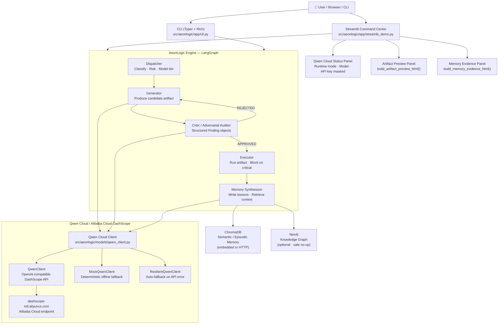

# AeonLogic — Architecture

> Full architecture reference with Mermaid diagram, component breakdown, Qwen Cloud integration, and environment-based secret handling.

---

## Architecture Diagram



---

## Component Reference

### Streamlit Command Center
**File:** `src/aeonlogic/app/streamlit_demo.py`

Pure consumer of the AeonLogic engine — no domain logic lives in the dashboard. All display helpers (`_build_summary`, `build_artifact_preview_html`, `build_memory_evidence_html`, `build_qwen_cloud_status`) are pure functions testable without a Streamlit runtime.

Key panels:
| Panel | Helper function |
|---|---|
| Agent timeline | `_timeline_html()` |
| Qwen Cloud status | `build_qwen_cloud_status()` |
| Artifact Preview | `build_artifact_preview_html()` |
| Memory Evidence | `build_memory_evidence_html()` |
| Run telemetry | `_build_summary()` |

---

### Qwen Cloud Client
**File:** `src/aeonlogic/models/qwen_client.py`

Three-class design:

| Class | Role |
|---|---|
| `QwenClient` | Production client — OpenAI-compatible DashScope API (Alibaba Cloud) |
| `MockQwenClient` | Deterministic offline fallback — zero API calls |
| `ResilientQwenClient` | Wraps `QwenClient`, auto-falls back to `MockQwenClient` on any exception |

Runtime mode is selected by `get_or_create_client()` at startup:
- `AEONLOGIC_MODE=real` + `QWEN_API_KEY` set → `ResilientQwenClient(QwenClient(...))`
- `AEONLOGIC_MODE=auto` + key present → `ResilientQwenClient(QwenClient(...))`
- `AEONLOGIC_MODE=mock` or no key → `MockQwenClient()`

The safe mock fallback ensures no pipeline crash on transient API errors or missing credentials.

---

### ChromaDB Memory
**File:** `src/aeonlogic/memory/chroma_store.py` / `src/aeonlogic/memory/hybrid_store.py`

`HybridMemoryStore` coordinates ChromaDB (authoritative) and Neo4j (best-effort):
- ChromaDB: persistent semantic embeddings — lessons retrieved by cosine similarity
- Neo4j: structured knowledge graph of `Task → Artifact → Lesson` edges
- If ChromaDB is unavailable: `MockMemoryStore` (in-process dict) takes over
- If Neo4j is unavailable: write is silently swallowed; pipeline always completes

---

### Neo4j Graph Interface
**File:** `src/aeonlogic/memory/neo4j_store.py`

Optional dependency — the entire pipeline runs correctly with Neo4j absent. `Neo4jMemoryStore` checks `self._available` before every operation; no URI configured → `NOT CONFIGURED` (not an error).

---

## Qwen Cloud / Alibaba Cloud Integration

### Required Environment Variables

```env
# Copy .env.example → .env and fill in real values.
# The .env file is never committed to VCS — only .env.example is tracked.

AEONLOGIC_MODE=real              # real | auto | mock
QWEN_API_KEY=sk-...              # Alibaba Cloud DashScope API key (QWEN_API_KEY)
QWEN_BASE_URL=https://dashscope-intl.aliyuncs.com/compatible-mode/v1
QWEN_MODEL=qwen-plus             # or qwen-turbo, qwen-max
```

The `QWEN_API_KEY` environment variable is **never hardcoded** in any source file. It is read exclusively from the environment at runtime via `aeonlogic.config.settings`. The `.env` file is listed in `.gitignore`; only `.env.example` (with empty key value) is committed to the repository. **No API key is committed to VCS.**

### Real Mode Code Path

```
settings.py          AEONLOGIC_MODE=real + QWEN_API_KEY
      │
      ▼
qwen_client.py       get_or_create_client()
      │                → QwenClient(api_key, base_url)
      │                → wrapped in ResilientQwenClient
      ▼
agents/generator.py  client.complete(budget, prompt)
      │                → POST https://dashscope-intl.aliyuncs.com/.../chat/completions
      ▼
agents/critic.py     client.complete(budget, adversarial_prompt)
      │
      ▼
Qwen Cloud response  parsed → candidate_artifact / critic_verdict / Finding objects
```

### Safe Mock Fallback

When `QWEN_API_KEY` is absent or `AEONLOGIC_MODE=mock`:
- `MockQwenClient` is used — returns deterministic, task-aware code strings
- No network call is made; no credentials are needed
- The full repair loop still executes: attempt 1 returns intentionally weak code, attempt 2 returns the hardened version
- The dashboard shows `● MOCK_MODEL_MODE` badge

When a real call fails at runtime:
- `ResilientQwenClient` catches the exception, calls `_set_active_mode("fallback")`
- Falls back to `MockQwenClient.complete()` for that request
- Dashboard shows `● FALLBACK_MODE` badge
- No crash; pipeline completes

---

## Deployment Targets

### Local (development)

```powershell
# Windows
$env:PYTHONPATH = "src"; $env:AEONLOGIC_MODE = "real"; $env:QWEN_API_KEY = "sk-..."
streamlit run src/aeonlogic/app/streamlit_demo.py
```

### Alibaba Cloud / Streamlit Community Cloud

AeonLogic is designed to deploy on any Python-hosting platform:
- Set `QWEN_API_KEY` as a **platform secret / environment variable** (never in source)
- Set `AEONLOGIC_MODE=real`
- Set `QWEN_BASE_URL` to the DashScope international endpoint
- `streamlit run src/aeonlogic/app/streamlit_demo.py` is the entry point

Alibaba Cloud Function Compute or ECS can host the Streamlit process. The DashScope API key is injected via the platform's secret management — never via the repository.

---

## Environment-Based Secret Handling

| Principle | Implementation |
|---|---|
| No secrets in source | `QWEN_API_KEY` read from env only; `.env` in `.gitignore` |
| Masked display | `mask_api_key()` in `qwen_client.py` — shows `sk-****...****` only |
| Key never logged | `build_qwen_cloud_status()` returns `api_key_masked`, never `api_key_raw` |
| Template committed | `.env.example` has empty `QWEN_API_KEY=` — safe to commit |
| Test isolation | All tests use `MockQwenClient`; `QWEN_API_KEY` is never needed in CI |
